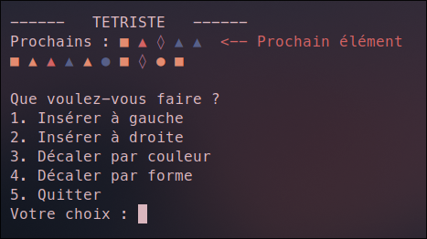

# Tetriste

## Screenshot

## Description

Tetriste is a game similar to the famous Tetris.\
It was made as part of a C programming project.

## Installation

### Manual installation

To install the game, just clone the git repository and compile the program with the `cmake . && make` command.

### Automatic installation

Hop over to the [release page](https://github.com/Exatio/tetriste/releases) and download the latest release.

## Usage

To launch the game in CLI mode, use the `./tetriste cli` command.
To start it in GUI mode, use the './tetriste gui' command.

## Controls

You can currently use the following controls:
- Insert a piece to the left
- Insert a piece to the right

The following controls are not yet implemented:
- Rotate through the shape cycle
- Rotate through the color cycle

