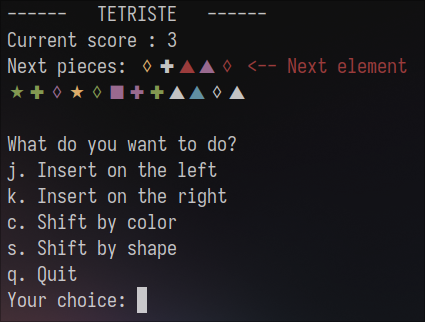
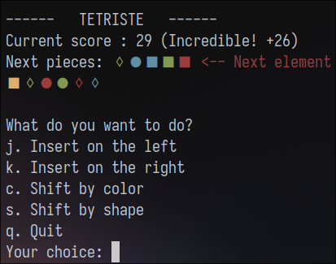
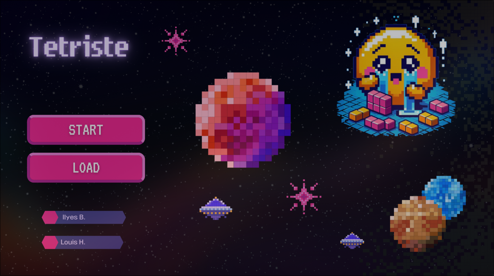
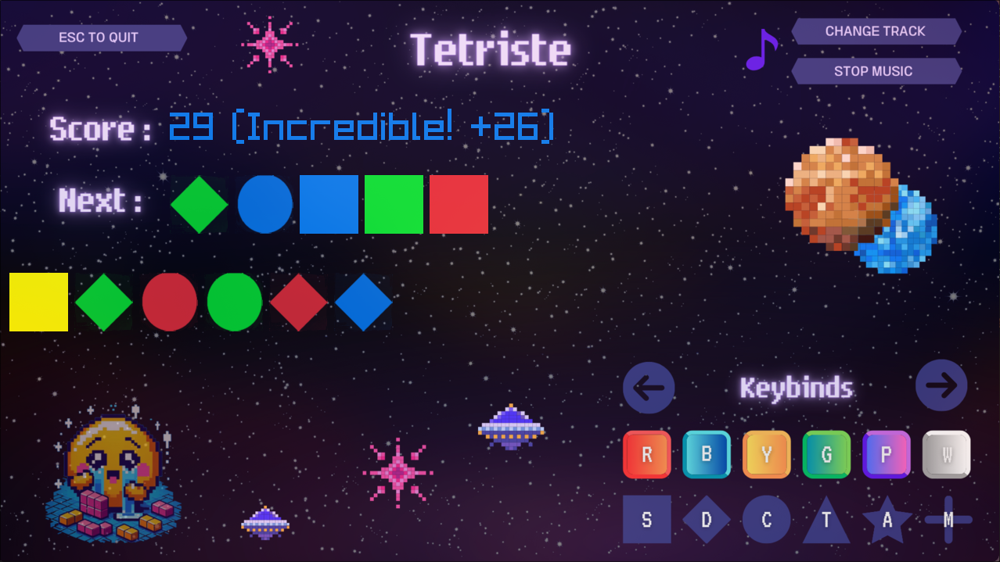
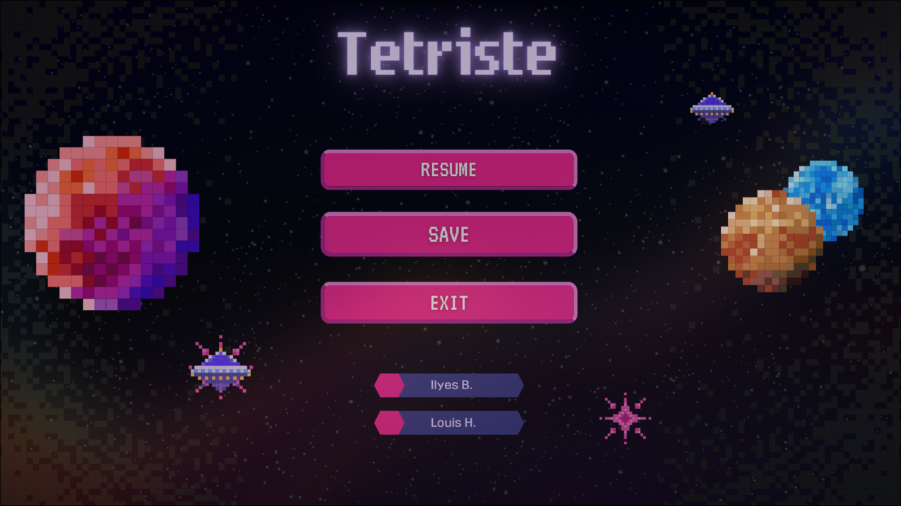

# Tetriste

## Screenshots

## Description

Tetriste is a game similar to the famous Tetris.\
It was made as part of a C programming project.

## Installation

To install the game, just clone the git repository and compile the program with the `make all` command.

## Usage

To launch the game in CLI mode, use the `./tetriste cli` command.\
To start it in GUI mode, use the `./tetriste gui` command.

## Controls

During the gameplay, you can currently use the following controls:
- Insert a piece to the left/right : Left/Right arrow
- Rotate through the shape cycle : S, D, C, T, A, M
- Rotate through the color cycle : R, B, Y, G, P, W
- Switch the music or disable it : 1, 2, 3, 4
- Pause menu : Esc 

## C Coding Style Conventions

We use the Hungarian C notation
